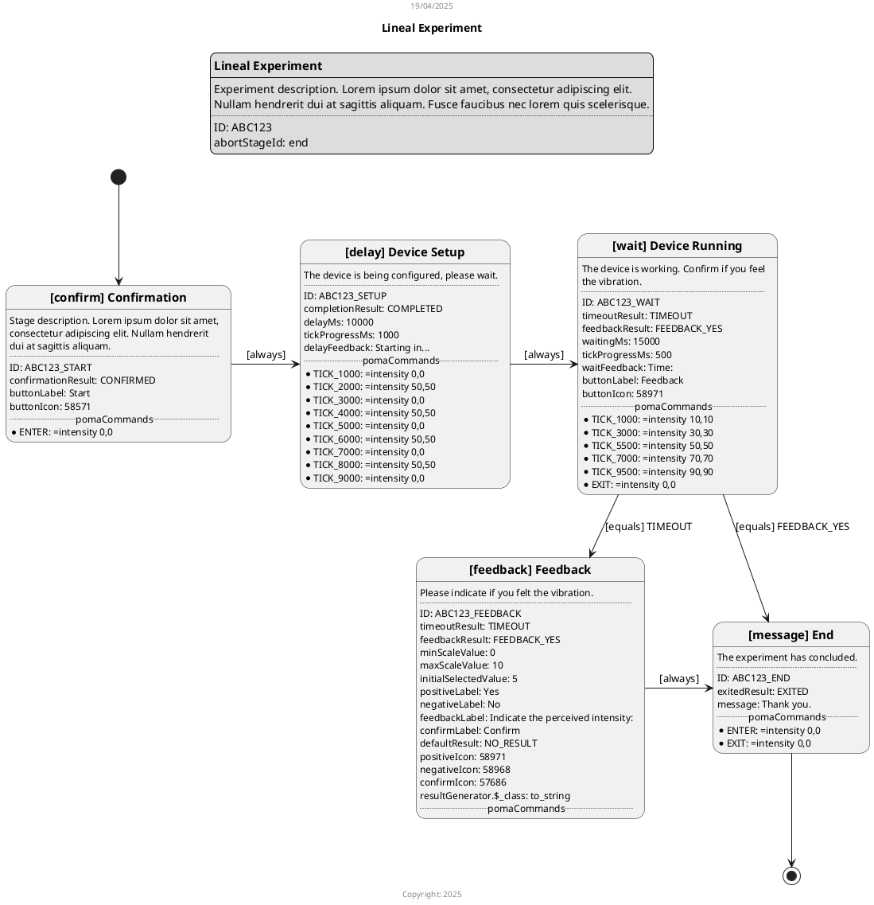

# Experiments Definition

## Experiment

### Definition

An **Experiment** is the configuration of an executable and repeatable trial.
The execution of the Experiment can be viewed as the flow of a state machine, where each state is a **Stage** of the
Experiment. At any given time during the execution of the Experiment, one and only one of its Stages will be active.
The rules that determine the transition between one Stage and another of an Experiment (i.e., the flow) are called
*Transitions*.

The Experiment has no inherent behavior beyond transitioning between Stages and communicating with a haptic device.
The Stages determine the specific behavior observed by the user.

Once a Stage is activated, its general behavior is to present the user with the controls specific to its type and
allow interaction with them.
The Stage will remain active until something in its internal behavior triggers a **Result**. This Result is
interpreted within the Experiment and used as input in the defined Transitions to select the next Stage to
activate.

#### Experiment State

The Experiment is considered to be in an "active" state as long as there is at least one Transition originating from the
current Stage. That is, it would be possible to advance to the next Stage. This does not take into account internal
details of the Transition (it only validates that there is one, even if it is invalid or irrelevant in the particular
context of the current trial).

The Experiment is considered to be in a "finished" state when a Stage is activated for which there are no Transitions
originating from it. That is, it is no longer possible to advance to the next Stage.

While the Experiment is "active" the following special operations can be performed: restart, finish, and abort.
When performing any of these operations, the currently active Stage will always be terminated, and the normal flow of
the Experiment will be altered.
The Stage that will become active after performing the operation will be:

* for the "restart" operation, the "initial" stage;
* For the "finish" operation, the "finish" stage;
* For the "abort" operation, the "abort" stage.

The experiment could continue depending on the Transitions configured.

### Properties

An **Experiment** consists of the following properties:

* **Descripción**: un texto descriptivo. Visible al usuario.
* **Etapas**: el conjunto de **Etapas** por las que puede pasar cada ensayo.
  Dentro del Experimento, cada Etapa es identificada por una Referencia única.
* **Transiciones**: el conjunto de **Reglas** que definen el flujo de ejecución del ensayo.
* **Etapa inicial**: la Etapa (perteneciente al conjunto de Etapas) que se debe visualizar al inicio del Experimento.
* **Etapa final**: la Etapa (perteneciente al conjunto de Etapas) que se debe visualizar cuando el Experimento finaliza.
* **Etapa de aborto**: la Etapa (perteneciente al conjunto de Etapas) que se debe visualizar cuando el Experimento es
  abortado.

* **ID**: a unique identifier for the Experiment. It must not be repeated among all Experiments in the system. It is not
  visible to the user.
* **Title**: a short description. Visible to the user.
* **Description**: a descriptive text. Visible to the user.
* **Stages**: the set of **Stages** that each trial can go through. Within the Experiment, each Stage is identified by a
  unique Reference.
* **Transitions**: the set of **Rules** that define the execution flow of the trial.
* **Start Stage**: the Stage (belonging to the set of Stages) that should be displayed at the beginning of the
  Experiment.
* **End Stage**: the Stage (belonging to the set of Stages) that should be displayed when the Experiment ends.
* **Abort Stage**: The Stage (belonging to the set of Stages) that must be visualized when the Experiment is aborted.

### JSON Representation

```json
{
  "id": "ABC123",
  "title": "Experiment",
  "description": "Experiment description. Lorem ipsum dolor sit amet, ...",
  "stages": {
    "ref_etapa_1": {
      /* ... Definition Stage 1 ... */
    },
    "ref_etapa_2": {
      /* ... Definition Etapa 2 ... */
    },
    /* ... Other Stages ... */
    "ref_etapa_n": {
      /* ... Definition Etapa N ... */
    }
  },
  "transitions": {
    "rules": [
      /* ... Transition Rules ... */
    ]
  },
  "startingStageId": "ref_etapa_1",
  "finalStageId": "ref_etapa_2",
  "abortStageId": "ref_etapa_n"
}
```

## Stage

### Definition

A **Stage** is a state that an Experiment can be in at any given time. It is a portion of the Experiment's flow, with a
beginning and an end, and it can be repeated.

There are different types of Stages, each defining:

* what the user sees on the screen, specifically the controls they can interact with;
* the event that marks the exit from the Stage (i.e., producing a result, which implies the transition to the next
  Stage); and
* the Experiment's behavior during the Stage.

### Basic Properties

Every **Stage** consists of the following basic properties:

* **ID**: un identificador único de la Etapa. No se debe repetir entre todas las Etapas de todos los Experimentos.
* **Tipo**: el tipo específico de Etapa.
* **Título**: una descripción corta. Visible al usuario. Según el *tipo* tiene diferentes valores por defecto.
* **Descripción**: un texto descriptivo, visible al usuario. Según el *tipo* tiene diferentes valores por defecto.
* **Comandos PoMA**: un conjunto de pares Evento-Comando que se usarán durante el transcurso de la Etapa. Cuando ocurra
  cada Evento, se enviará el Comando correspondiente al dispositivo PoMA conectado con el Experimento (pulsera háptica).

* **ID**: a unique identifier for the Stage. It must not be repeated across all Stages in all Experiments.
* **Type**: the specific type of Stage.
* **Title**: a short description. Visible to the user. Depending on the *type*, it has different default values.
* **Description**: a descriptive text, visible to the user. Depending on the *type*, it has different default values.
* **PoMA Commands**: a set of Event-Command pairs that will be used during the Stage. When each Event occurs, the
  corresponding Command will be sent to the PoMA device connected to the Experiment (haptic wristband).

Each *type* of Stage defines additional properties.

### Basic JSON representation

```json
{
  "id": "ABC123_START",
  "title": "Confirmation",
  "description": "Stage description. Lorem ipsum dolor sit amet, ...",
  "pomaCommands": {
    "ENTER": "= enabled_motors 1,1,0,0,0,0",
    /* ... Other Event-Command pairs ... */
    "EXIT": "= enabled_motors 0,0,0,0,0,0"
  },
  "$_class": "<<STAGE_TYPE>>"
}
```

### Types of Stages

#### Confirm

The behavior of this Stage is to present the user with a confirmation button.
The Stage returns a fixed result (and therefore ends) when the user presses the button (i.e., when they confirm).

The additional properties of Confirm Stages are:

* **Result**: the value of the Result returned upon confirmation.
* **Label**: the text of the confirmation button. By default, `Start`.
* **Icon**: the icon that goes with the button. By default, a "play" icon (triangle).

##### JSON Representation

```json
{
  "$_class": "confirm",
  "confirmationResult": "CONFIRMED",
  "buttonLabel": "Start",
  "buttonIcon": 58571
}
```

#### Delay

The behavior of this Stage is to display a progress bar that fills up as time passes.
After a predetermined (configurable) amount of time has elapsed, the Stage returns a fixed result.

The additional properties of Delay Stages are:

* **Result**: the value of the Result returned when the time is up.
* **Delay**: the amount of time (in milliseconds) to delay. Default: `10,000`.
* **Tick**: the amount of time (in milliseconds) to elapse before updating the progress bar. Default: `100`.
* **Feedback**: the text that goes with the progress bar. Default: `Starting in...`.
* **Show Progress Bar**: a boolean value indicating whether the progress bar should be displayed. Default: `true`.

##### JSON Representation

```json
{
  "$_class": "delay",
  "completionResult": "COMPLETED",
  "delayMs": 10000,
  "tickProgressMs": 100,
  "delayFeedback": "Starting in...",
  "showProgressBar": true
}
```

#### Wait

The behavior of this Stage is similar to that of the Delay stage, with the difference that a button is also displayed.
The stage returns a fixed result when a certain amount of time has elapsed; and another fixed result is returned if the
user presses the button.

The additional properties of Wait Stages are:

* **Timeout Result**: the value of the Result returned when the time is up.
* **Feedback Result**: the value of the Result returned when the button is pressed.
* **Wait**: the amount of time (in milliseconds) to wait. Default: `10,000`.
* **Tick**: the amount of time (in milliseconds) to elapse before updating the progress bar. Default: `100`.
* **Feedback**: the text that goes with the progress bar. Default: `Time:`.
* **Label**: the text of the button. Default: `Feedback`.
* **Icon**: the icon that goes with the button. By default, a "thumbs up" icon.
* **Show Progress Bar**: a boolean value indicating whether the progress bar should be displayed. By default, `true`.

##### JSON Representation

```json
{
  "$_class": "wait",
  "timeoutResult": "TIMEOUT",
  "feedbackResult": "FEEDBACK_YES",
  "waitingMs": 15000,
  "tickProgressMs": 500,
  "waitFeedback": "Time:",
  "buttonLabel": "Feedback",
  "buttonIcon": 58971,
  "showProgressBar": true
}
```

#### Feedback

The behavior of this Stage is to present the user with two buttons for providing feedback: one for affirmation and one
for negation.
If the user presses the affirmation button, a (configurable) scale of values and a third button are presented. Pressing
this third button results in the Stage returning the selected value on the scale.
Conversely, if the user presses the negation button, the Stage returns the minimum value on the scale (without
presenting the scale or the third button).

Additional properties of Feedback Stages are:

* **Minimum Value**: the minimum selectable value on the scale. Default is `0`.
* **Maximum Value**: the maximum selectable value on the scale. Default is `10`.
* **Initial Value**: the value initially selected on the scale. Default is `5`.
* **Positive Label**: the text of the affirmation button. Default is `Yes`.
* **Negative Label**: the text of the negative button. By default, `No`.
* **Feedback**: the text accompanying the scale. By default, `Indicate the perceived intensity:`.
* **Confirmation Label**: the text of the final confirmation button. By default, `Confirm`.
* **Positive Icon**: the icon that goes with the positive button. By default, a "thumbs up" icon.
* **Negative Icon**: the icon that goes with the negative button. By default, a "thumbs down" icon.
* **Confirmation Icon**: the icon that goes with the confirmation button. By default, a "checkmark" icon.
* **Result Generator**: a function that translates the numerical results of the scale into the Results that the Stage
  returns.
* **Default Result**: the Result that is returned if a *Result Generator* function is not defined.

##### JSON Representation

```json
{
  "$_class": "feedback",
  "minScaleValue": 0,
  "maxScaleValue": 10,
  "initialSelectedValue": 5,
  "positiveLabel": "Yes",
  "negativeLabel": "No",
  "feedbackLabel": "Indicate the perceived intensity:",
  "confirmLabel": "Confirm",
  "defaultResult": "NO_RESULT",
  "positiveIcon": 58971,
  "negativeIcon": 58968,
  "confirmIcon": 57686,
  "resultGenerator": {
    "$_class": "<<RESULT_GENERATOR_TYPE>>"
  }
}
```

#### Select

The behavior of this Stage is to present the user with a list of options to select. It allows both single and multiple
selections, and the options can be displayed as text or images.
Upon confirmation of the selection, the Stage returns the value of the selected option (or the values concatenated by
`;` in the case of multiple selection).

The additional properties of Selection Stages are:

* **Question**: the text of the question or instruction displayed to the user. By default, `Select an option:`.
* **Multiple Selection**: a boolean value indicating whether more than one option can be selected. By default, `false`.
* **Shuffle Options**: a boolean value indicating whether the options should be presented in random order. By default,
  `false`.
* **Options**: a list of objects that define the available options (see [Selection Options](#selection-options)).
* **Confirm Label**: the text of the confirmation button. Default: `Confirm`.
* **Confirm Icon**: the icon that goes with the confirmation button. Default: a "checkmark" icon.
* **Clear Label**: the text of the button to clear the selection. Default: `Clear`.
* **Clear Icon**: the icon that goes with the clear button. Default: an "X" icon.

##### Selection Options

Each object within the **Options** list consists of the following properties:

* **Label**: the descriptive text for the option.
* **Value**: the value that will be returned as a result if this option is selected.
* **Image**: optional. A path to an image resource (this can be a local asset such as `assets/...` or a remote URL such
  as `https://...`). If an image is provided, it will be displayed instead of the text label.

##### JSON Representation

```json
{
  "$_class": "select",
  "question": "Which one do you prefer?",
  "multipleSelection": false,
  "shuffleOptions": true,
  "options": [
    {
      "label": "Option A",
      "value": "RESULT_A"
    },
    {
      "label": "Option B",
      "value": "RESULT_B",
      "image": "assets/images/option_b.png"
    }
  ],
  "confirmButtonLabel": "Confirm",
  "confirmButtonIcon": 57686,
  "clearButtonLabel": "Clear",
  "clearButtonIcon": 57671
}
```

#### Message

The behavior of this Stage is to present the user with a message without any other actionable controls.
This stage never returns a result, so it never ends. The only way to end it would be to restart, finish, or abort the
Experiment.

The additional properties of Message Stages are:

* **Result**: the value of the Result that is returned when the Stage ends (only possible externally).
* **Message**: the message text displayed to the user. By default, `Thank you.`.

##### JSON Representation

```json
{
  "$_class": "message",
  "exitedResult": "EXITED",
  "message": "Thank you."
}
```

#### Shuffle

This special Stage allows you to execute a pool of stages in random order. Its behavior is to automatically redirect to
the next stage in the pool that has not yet been visited.

For the cycle to work, the stages in the pool must have transition rules that return them to the randomization stage
upon completion. Once all stages in the pool have been visited, the Shuffle Stage returns a final result to continue the
normal flow.

Additional properties of Shuffle Stages are:

* **Stages**: a list of the identifiers (references) of the stages in the pool.
* **Result**: the value of the Result that is returned once all stages in the pool have been completed.

##### JSON Representation

```json
{
  "$_class": "shuffle",
  "stages": [
    "stage_a",
    "stage_b",
    "stage_c"
  ],
  "completionResult": "POOL_COMPLETED"
}
```

### Events / Stages Lifecycle

Events occur during the lifecycle a Stage. There are two Events that occur in every Stage: when a Stage is activated
(and therefore entered), the "ENTER" event occurs; while when the stage ends, the "EXIT" event occurs.

In Delay and Wait stages, since they interact with elapsed time, "TICK_XXXX" events also occur, where "XXXX" is the
number of milliseconds elapsed since the start of the stage. For example, the events "TICK_1000" and "TICK_5000" will
occur: the first one second after the start of the Stage; and then, four seconds later, the second.

Currently, these are the only possible events. In the future, each Stage type could define its own events.

### PoMA Commandos

A set of PoMA commands can be defined for each Stage.
Each command is associated with an Event; therefore, when that Event occurs, the Experiment containing the Stage will
send the command to the connected PoMA device. If no device is connected when the Event occurs, the command will not be
sent.

For example, if the following Event-Command pairs are defined:

```json
{
  "pomaCommands": {
    "ENTER": "= enabled_motors 1,1,0,0,0,0",
    "TICK_1000": "= intensity 50,50",
    "TICK_5000": "= intensity 0,0",
    "EXIT": "= enabled_motors 0,0,0,0,0,0"
  }
  // ...
}
```

Al entrar en la Etapa se enviará el comando PoMA `= enabled_motors 1,1,0,0,0,0`; luego, transcurrido un segundo, se
enviará el comando `= intensity 50,50`; transcurridos cuatro segundos más se enviará `= intensity 0,0`; finalmente, al
salir de la Etapa, se enviará, `= enabled_motors 0,0,0,0,0,0`.

Upon entering the Stage, the command PoMA `= enabled_motors 1,1,0,0,0,0` will be sent; then, after one second, the
command `= intensity 50,50` will be sent; after four more seconds, `= intensity 0,0` will be sent; finally, upon exiting
the Stage, `= enabled_motors 0,0,0,0,0,0` will be sent.

## Transition Rules

A **Transition Rule** defines a decision within the flow of an Experiment. The Rule consists of an origin Stage, a
destination Stage, and an activation condition, which is a boolean function.

Upon completion of a Stage, all Rules of the Experiment that have that stage as their "origin" are evaluated in order.
The evaluation consists of invoking the aforementioned activation condition function.
The first Rule that results in `TRUE` will be used to determine the next stage to activate (the "destination" stage);
the remaining Rules are not evaluated. The condition function is invoked using the result of the Stage as input.

There are different types of condition functions.

### Properties

A **Rule** consists of the following properties:

* **Origin**: the reference to the "origin" Stage within the Experiment.
* **Destination**: the reference to the "destination" Stage within the Experiment.
* **Condition Function**: the specific type of condition function that must be invoked to evaluate the transition.

### JSON Representation

```json
{
  "origin": "ref_stage_origin",
  "trigger": {
    "$_class": "<<CONDITION_FUNCTION_TYPE>>"
  },
  "destination": "ref_stage_destination"
}
```

### Types of Condition Functions

#### Always

This function ignores the received input and always evaluates to `TRUE`. Therefore, Rules subsequent to this one will
never be evaluated.

##### JSON Representation

```json
{
  "$_class": "always"
}
```

#### Never

This function ignores the received input and always evaluates to `FALSE`. Therefore, the transition corresponding to
this rule will never be executed.

##### JSON Representation

```json
{
  "$_class": "never"
}
```

#### Distinct

This function takes a reference value. When the function is evaluated, it returns `FALSE` if the input matches the
reference value. Otherwise, it returns `TRUE`.

##### JSON Representation

```json
{
  "$_class": "distinct",
  "notExpected": "<<REFERENCE_VALUE>>"
}
```

#### Equals

This function is the inverse of the previous one. `TRUE` is evaluated if and only if the input is equal to the reference
value.

##### JSON Representation

```json
{
  "$_class": "equals",
  "expected": "<<REFERENCE_VALUE>>"
}
```

#### Greater Than

This function takes an integer reference value. When the function is evaluated, it returns `TRUE` if the input is
*greater than* the reference value, or `FALSE` otherwise.

This function requires an internal function that converts the input to numeric values comparable to the reference
value. Currently, the default function is the only one allowed; this function returns 0 for null values, returns the
given value for integers, converts decimal values to integers, and for any other value, converts it to a string and
then attempts to parse it to an integer, returning the parsing result or 0 if the parsing fails.

##### JSON Representation

```json
{
  "$_class": "greater_than",
  "compareTo": 5
}
```

#### Lesser Than

This function is equivalent to the **Greater Than** function, with the difference that it evaluates to `TRUE` only if
the input is *less than* the given reference value.

##### JSON Representation

```json
{
  "$_class": "lesser_than",
  "compareTo": 5
}
```

# Icons

To get the numerical values of the icons:

[Google Icons](https://fonts.google.com/icons?icon.size=24&icon.color=%231f1f1f&icon.set=Material+Icons)

[Flutter Material Icons](https://github.com/flutter/flutter/blob/master/packages/flutter/lib/src/material/icons.dart)

# pUML Definition of an Experiment *(WIP)*


