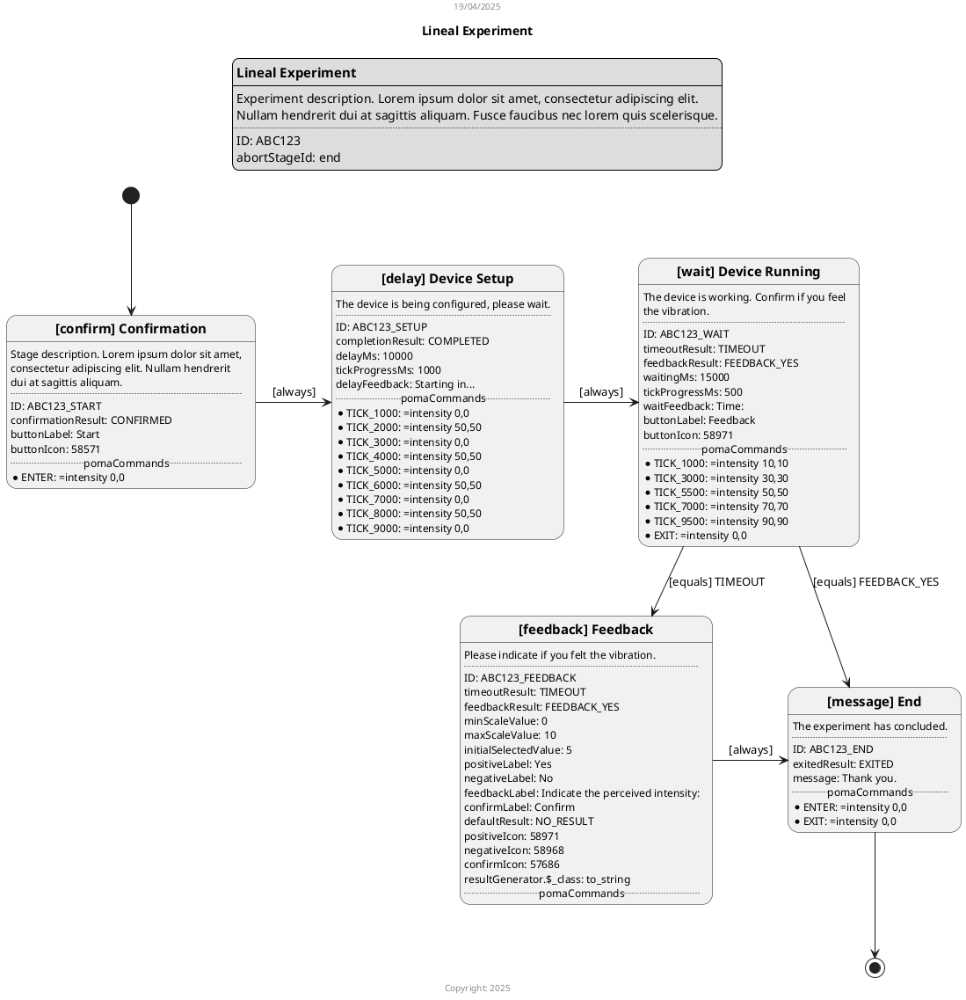

# Definición de Experimentos

## Experimento

### Definición

Un **Experimento** es la configuración de un ensayo ejecutable y repetible.
La ejecución del Experimento se puede ver como el flujo de una máquina de estados,
en donde cada estado es una **Etapa** del Experimento. En todo momento durante la ejecución del Experimento
estará activa una y solo una de sus Etapas.
Las reglas que determinan el pasaje entre una y otra Etapa de un Experimento (es decir, el flujo) se denominan *
*Transiciones**.

El Experimento no posee comportamiento propio más allá de transicionar entre Etapas y comunicarse con el dispositivo
háptico.
El comportamiento específico que observa el usuario está determinado por las Etapas.

Una vez que una Etapa es activada, el comportamiento general es presentar al usuario los controles propios de su tipo y
permitir la interacción con estos.
La Etapa permanecerá activa hasta tanto algo en su comportamiento interno lance un **Resultado**. Este Resultado es
interpretado dentro del Experimento y usado como input en las Transiciones definidas a fin de elegir la próxima Etapa a
activar.

#### Estado del Experimento

El Experimento se considera en estado "activo" siempre que exista al menos una Transición cuyo origen sea la Etapa
actual.
Es decir, que sería posible avanzar a una siguiente Etapa. Esto no toma en consideración detalles internos de la
Transición (solo se valida que haya una, aunque sea inválida o irrelevante en el contexto particular del ensayo actual).

El Experimento se considera en estado "finalizado" cuando se activa una Etapa para la cual no existen Transiciones que
la tengan como origen.
Es decir, que ya no es posible avanzar a una siguiente Etapa.

Mientras el Experimento esté "activo" se pueden realizar las siguientes operaciones especiales: reiniciar, finalizar, y
abortar.
Al efectuar alguna de estas operaciones, en todos los casos se finalizará la Etapa activa actual y se alterará el flujo
normal del Experimento.
La Etapa que resultará activa luego de realizar la operación será:

* para la operación de "reiniciar", la etapa "inicial";
* para la operación de "finalizar", la etapa "final";
* para la operación de "abortar", la etapa "de aborto".

El experimento podría continuar según las Transiciones que tenga configuradas.

### Propiedades

Un **Experimento** consta de las siguientes propiedades:

* **ID**: un identificador único del Experimento.
  No se debe repetir entre todos los Experimentos del sistema.
  No es visible al usuario.
* **Título**: una descripción corta. Visible al usuario.
* **Descripción**: un texto descriptivo. Visible al usuario.
* **Etapas**: el conjunto de **Etapas** por las que puede pasar cada ensayo.
  Dentro del Experimento, cada Etapa es identificada por una Referencia única.
* **Transiciones**: el conjunto de **Reglas** que definen el flujo de ejecución del ensayo.
* **Etapa inicial**: la Etapa (perteneciente al conjunto de Etapas) que se debe visualizar al inicio del Experimento.
* **Etapa final**: la Etapa (perteneciente al conjunto de Etapas) que se debe visualizar cuando el Experimento finaliza.
* **Etapa de aborto**: la Etapa (perteneciente al conjunto de Etapas) que se debe visualizar cuando el Experimento es
  abortado.

### Representación JSON

```json
{
  "id": "ABC123",
  "title": "Experiment",
  "description": "Experiment description. Lorem ipsum dolor sit amet, ...",
  "stages": {
    "ref_etapa_1": {
      /* ... Definición Etapa 1 ... */
    },
    "ref_etapa_2": {
      /* ... Definición Etapa 2 ... */
    },
    /* ... Otras Etapas ... */
    "ref_etapa_n": {
      /* ... Definición Etapa N ... */
    }
  },
  "transitions": {
    "rules": [
      /* ... Reglas de Transición ... */
    ]
  },
  "startingStageId": "ref_etapa_1",
  "finalStageId": "ref_etapa_2",
  "abortStageId": "ref_etapa_n"
}
```

## Etapa

### Definición

Una **Etapa** es un estado en el que puede estar un Experimento en un momento dado. Es una porción del flujo del
Experimento, que tiene un inicio y un fin, y puede repetirse.

Hay diferentes tipos de Etapa, cada uno define:

* lo que visualiza el usuario en pantalla, en particular los controles con los que puede interactuar;
* el evento que marca la salida de la Etapa (es decir, arrojar un resultado, lo cual implica la transición a la
  siguiente Etapa); y
* el comportamiento del Experimento durante la Etapa.

### Propiedades básicas

Toda **Etapa** consta de las siguientes propiedades básicas:

* **ID**: un identificador único de la Etapa. No se debe repetir entre todas las Etapas de todos los Experimentos.
* **Tipo**: el tipo específico de Etapa.
* **Título**: una descripción corta. Visible al usuario. Según el *tipo* tiene diferentes valores por defecto.
* **Descripción**: un texto descriptivo, visible al usuario. Según el *tipo* tiene diferentes valores por defecto.
* **Comandos PoMA**: un conjunto de pares Evento-Comando que se usarán durante el transcurso de la Etapa. Cuando ocurra
  cada Evento, se enviará el Comando correspondiente al dispositivo PoMA conectado con el Experimento (pulsera háptica).

Cada *tipo* de Etapa define propiedades adicionales.

### Representación JSON básica

```json
{
  "id": "ABC123_START",
  "title": "Confirmation",
  "description": "Stage description. Lorem ipsum dolor sit amet, ...",
  "pomaCommands": {
    "ENTER": "= enabled_motors 1,1,0,0,0,0",
    /* ... Otros pares Evento-Comando ... */
    "EXIT": "= enabled_motors 0,0,0,0,0,0"
  },
  "$_class": "__TIPO_DE_LA_ETAPA__"
}
```

### Tipos de Etapas

#### Confirmar

El comportamiento de esta Etapa es presentar al usuario un botón de confirmación.
La Etapa lanza un resultado fijo (y, por lo tanto, finaliza) cuando el usuario presiona el botón (es decir, cuando
confirma).

Las propiedades adicionales de Etapas Confirmar son:

* **Resultado**: el valor del Resultado que se lanza al confirmar.
* **Etiqueta**: el texto del botón de confirmación. Por defecto, `Start`.
* **Ícono**: el ícono que acompaña el botón. Por defecto, ícono de "play" (triángulo).

##### Representación JSON

```json
{
  "$_class": "confirm",
  "confirmationResult": "CONFIRMED",
  "buttonLabel": "Start",
  "buttonIcon": 58571
}
```

#### Demorar

El comportamiento de esta Etapa es visualizar una barra de progreso que se irá completando a medida que pasa el tiempo.
Luego de transcurrido una cantidad de tiempo determinada (configurable), la Etapa lanza un resultado fijo.

Las propiedades adicionales de Etapas Demorar son:

* **Resultado**: el valor del Resultado que se lanza al completarse el tiempo.
* **Demora**: la cantidad de tiempo (en milisegundos) que se debe demorar. Por defecto, `10.000`.
* **Tick**: la cantidad de tiempo (en milisegundos) que debe transcurrir antes de actualizar la barra de progreso. Por
  defecto, `100`.
* **Feedback**: el texto que acompaña a la barra de progreso. Por defecto, `Starting in...`.

##### Representación JSON

```json
{
  "$_class": "delay",
  "completionResult": "COMPLETED",
  "delayMs": 10000,
  "tickProgressMs": 100,
  "delayFeedback": "Starting in..."
}
```

#### Esperar

El comportamiento de esta Etapa es similar al de Demorar, con la diferencia de que se visualiza además un botón.
La etapa lanza un resultado fijo cuando se alcanza una cantidad de tiempo determinada; y se lanza otro resultado fijo
si el usuario presiona el botón.

Las propiedades adicionales de Etapas Esperar son:

* **Resultado Timeout**: el valor del Resultado que se lanza al completarse el tiempo.
* **Resultado Feedback**: el valor del Resultado que se lanza al presionar el botón.
* **Espera**: la cantidad de tiempo (en milisegundos) que se debe esperar. Por defecto, `10.000`.
* **Tick**: la cantidad de tiempo (en milisegundos) que debe transcurrir antes de actualizar la barra de progreso. Por
  defecto, `100`.
* **Feedback**: el texto que acompaña a la barra de progreso. Por defecto, `Time:`.
* **Etiqueta**: el texto del botón. Por defecto, `Feedback`.
* **Ícono**: el ícono que acompaña el botón. Por defecto, ícono de "pulgar arriba".

##### Representación JSON

```json
{
  "$_class": "wait",
  "timeoutResult": "TIMEOUT",
  "feedbackResult": "FEEDBACK_YES",
  "waitingMs": 15000,
  "tickProgressMs": 500,
  "waitFeedback": "Time:",
  "buttonLabel": "Feedback",
  "buttonIcon": 58971
}
```

#### Feedback

El comportamiento de esta Etapa es presentar al usuario dos botones para dar feedback: un botón es afirmativo y otro
negativo.
Si el usuario presiona el botón afirmativo, se le presenta una escala de valores (configurable) y un tercer botón. Al
presionar este tercer botón la Etapa lanza como resultado el valor seleccionado en la escala.
Si, por lo contrario, el usuario presiona el botón negativo, entonces la Etapa lanza como resultado el valor mínimo de
la
escala (sin presentar la escala ni el tercer botón)

Las propiedades adicionales de Etapas Feedback son:

* **Valor Mínimo**: el valor mínimo seleccionable de la escala. Por defecto, `0`.
* **Valor Máximo**: el valor máximo seleccionable de la escala. Por defecto, `10`.
* **Valor Inicial**: el valor inicialmente seleccionado en la escala. Por defecto, `5`.
* **Etiqueta Positiva**: el texto del botón afirmativo. Por defecto, `Yes`.
* **Etiqueta Negativa**: el texto del botón negativo. Por defecto, `No`.
* **Feedback**: el texto que acompaña a la escala de valores. Por defecto, `Indicate the perceived intensity:`.
* **Etiqueta Confirmación**: el texto del botón final de confirmación. Por defecto, `Confirm`.
* **Ícono Positivo**: el ícono que acompaña al botón positivo. Por defecto, ícono de "pulgar arriba".
* **Ícono Negativo**: el ícono que acompaña al botón negativo. Por defecto, ícono de "pulgar abajo".
* **Ícono Confirmación**: el ícono que acompaña al botón de confirmación. Por defecto, ícono de "marca de tilde".
* **Generador de Resultado**: una función que traduce los resultados numéricos de la escala a los Resultados que lanza
  la Etapa.
* **Resultado Por Defecto**: el Resultado que se lanza si no se define una función *Generador de Resultado*.

##### Representación JSON

```json
{
  "$_class": "feedback",
  "minScaleValue": 0,
  "maxScaleValue": 10,
  "initialSelectedValue": 5,
  "positiveLabel": "Yes",
  "negativeLabel": "No",
  "feedbackLabel": "Indicate the perceived intensity:",
  "confirmLabel": "Confirm",
  "defaultResult": "NO_RESULT",
  "positiveIcon": 58971,
  "negativeIcon": 58968,
  "confirmIcon": 57686,
  "resultGenerator": {
    "$_class": "__TIPO_DE_GENERADOR__"
  }
}
```

#### Mensaje

El comportamiento de esta Etapa es presentar al usuario un mensaje sin ningún otro control accionable.
Esta etapa no lanza nunca un resultado, de modo que nunca termina. La única forma de terminar sería reiniciar,
finalizar o abortar el Experimento.

Las propiedades adicionales de Etapas Mensaje son:

* **Resultado**: el valor del Resultado que se lanza al finalizar la Etapa (solo posible de manera externa).
* **Mensaje**: el texto de mensaje que se visualiza al usuario. Por defecto, `Thank you.`.

##### Representación JSON

```json
{
  "$_class": "message",
  "exitedResult": "EXITED",
  "message": "Thank you."
}
```

#### Randomización (Shuffle)

Esta Etapa especial permite ejecutar un conjunto (pool) de etapas en orden aleatorio. El comportamiento es redirigir
automáticamente a la siguiente etapa del pool que no haya sido visitada aún.

Para que el ciclo funcione, las etapas contenidas en el pool deben tener reglas de transición que las devuelvan a la
etapa de randomización al finalizar. Una vez que todas las etapas del pool han sido visitadas, la etapa de randomización
lanza un resultado final para continuar con el flujo normal.

Las propiedades adicionales de Etapas Randomización son:

* **Etapas**: una lista de identificadores (referencias) de las etapas que deben ser ejecutadas en orden aleatorio.
* **Resultado**: el valor del Resultado que se lanza una vez que se han completado todas las etapas del pool.

##### Representación JSON

```json
{
  "$_class": "shuffle",
  "stages": [
    "etapa_a",
    "etapa_b",
    "etapa_c"
  ],
  "completionResult": "POOL_COMPLETED"
}
```

### Eventos / Ciclo de vida de Etapas

Durante el transcurso de una Etapa ocurren Eventos. Hay dos Eventos que transcurren en toda Etapa:
cuando se activa (y, por lo tanto, se ingresa a) una Etapa, ocurre el evento "ENTER"; mientras que cuando la etapa
finaliza, ocurre el evento "EXIT".

En las etapas de tipo Demorar y Esperar, dado que interactúan con el tiempo transcurrido, ocurren también eventos
"TICK_XXXX", siendo "XXXX" los milisegundos transcurridos desde el inicio de la etapa. Por ejemplo, los eventos
`TICK_1000` y `TICK_5000` sucederán: el primero, transcurrido un segundo desde el inicio de la Etapa; y luego,
transcurridos cuatro segundos más, el segundo.

Actualmente, estos son los únicos Eventos posibles. A futuro, cada tipo de Etapa podría definir Eventos propios.

### Comandos PoMA

Para toda Etapa se puede definir un conjunto de comandos PoMA.
Cada comando se asocia a un Evento; de modo tal que al momento de ocurrir dicho Evento el Experimento contenedor de la
Etapa se encargará de enviar el comando al dispositivo PoMA conectado. En caso que no hubiera un dispositivo conectado
al momento de ocurrir el Evento, entonces no se enviará el comando correspondiente.

Ejemplo, si se definen los siguientes pares Evento-Comando:

```json
{
  "pomaCommands": {
    "ENTER": "= enabled_motors 1,1,0,0,0,0",
    "TICK_1000": "= intensity 50,50",
    "TICK_5000": "= intensity 0,0",
    "EXIT": "= enabled_motors 0,0,0,0,0,0"
  }
  // ...
}
```

Al entrar en la Etapa se enviará el comando PoMA `= enabled_motors 1,1,0,0,0,0`; luego, transcurrido un segundo, se
enviará el comando `= intensity 50,50`; transcurridos cuatro segundos más se enviará `= intensity 0,0`; finalmente, al
salir de la Etapa, se enviará, `= enabled_motors 0,0,0,0,0,0`.

## Regla de Transición

Una **Regla de Transición** define una decisión dentro del flujo de un Experimento. La Regla se compone de una Etapa
origen, una etapa destino, y una condición de activación, la cual es una función booleana.

Al finalizar una Etapa se evalúan, en orden, todas las Reglas del Experimento que tengan a dicha etapa como "origen".
La evaluación consiste en invocar la función condición de activación mencionada.
La primera Regla que dé como resultado `TRUE` se utilizará para determinar la siguiente Etapa a activar (la etapa
"destino"); omitiéndose evaluar las Reglas restantes. La función condición se invoca utilizando el resultado de la Etapa
como input.

Existen distintos tipos de función condición.

### Propiedades

Una **Regla** consta de las siguientes propiedades:

* **Origen**: la referencia de la Etapa "origen" dentro del Experimento.
* **Destino**: la referencia de la Etapa "destino" dentro del Experimento.
* **Función Condición**: el tipo específico de función condición que se debe invocar para evaluar la transición.

### Representación JSON

```json
{
  "origin": "ref_etapa_origen",
  "trigger": {
    "$_class": "__TIPO_DE_FUNCION_CONDICION__"
  },
  "destination": "ref_etapa_destino"
}
```

### Tipos de Función Condición

#### Siempre

Esta función ignora el input recibido y siempre evalúa `TRUE`. De modo que nunca se evaluarán Reglas posteriores a esta.

##### Representación JSON

```json
{
  "$_class": "always"
}
```

#### Nunca

Esta función ignora el input recibido y siempre evalúa `FALSE`. De modo que la transición que corresponda con esta regla
nunca se ejecutará.

##### Representación JSON

```json
{
  "$_class": "never"
}
```

#### Distinto

Esta función toma un valor de referencia. Al momento de evaluar la función, se retorna `FALSE` si el input coincide con
el valor de referencia. En cualquier otro caso, retorna `TRUE`.

##### Representación JSON

```json
{
  "$_class": "distinct",
  "notExpected": "valor_de_referencia"
}
```

#### Igual

Esta función es la inversa a la anterior. Se evalúa `TRUE` si y sólo si el input es igual al valor de referencia.

##### Representación JSON

```json
{
  "$_class": "equals",
  "expected": "valor_de_referencia"
}
```

#### Mayor

Esta función toma un valor numérico entero de referencia. Al momento de evaluar la función, se retorna `TRUE` si el
input es *mayor* al valor de referencia, o `FALSE` en caso contrario.

Esta función tiene como requisito una función interna que convierta el input a valores numéricos comparables con el
valor de referencia. Actualmente, la función por defecto es la única permitida; esta función retorna 0 para valores
nulos, en caso de valores enteros retorna el valor dado, en caso de valores decimales los convierte a enteros, y para
cualquier otro valor lo convierte a string y luego intenta parsearlo a entero, retorna el resultado del parseo o bien 0
en caso de que falle el parseo.

##### Representación JSON

```json
{
  "$_class": "greater_than",
  "compareTo": 5
}
```

#### Menor

Esta función es equivalente a la función **Mayor**, con la diferencia que evalúa `TRUE` sólo si el input es *menor* que
el valor de referencia dado.

##### Representación JSON

```json
{
  "$_class": "lesser_than",
  "compareTo": 5
}
```

# Íconos

Para tomar los valores numéricos de los íconos:

[Google Icons](https://fonts.google.com/icons?icon.size=24&icon.color=%231f1f1f&icon.set=Material+Icons)

[Flutter Material Icons](https://github.com/flutter/flutter/blob/master/packages/flutter/lib/src/material/icons.dart)

# Definición pUML de un Experimento


